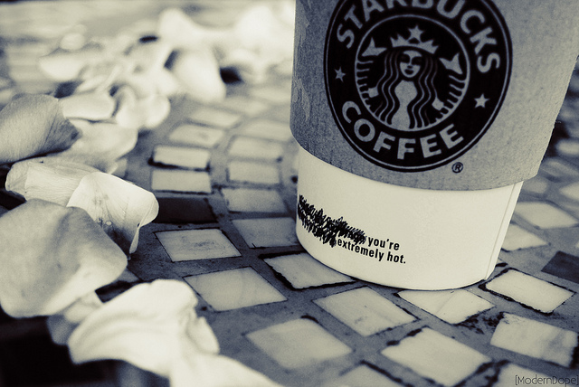
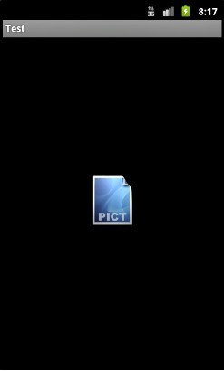
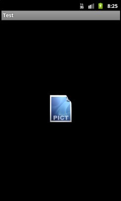
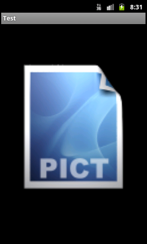
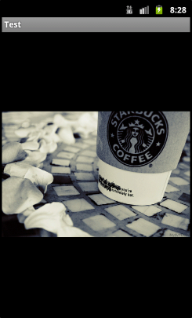
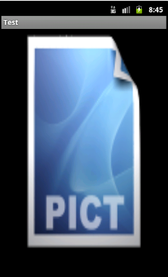
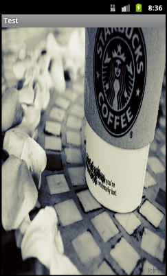

## for Android: ImageView.ScaleType | ImageView.ScaleType设置图解 
>
- 设置方式
- ScaleType各类型图解

#### 设置方式
1. 在layout xml中定义
```xml
android:scaleType="center" 
```  
2. 或在代码中调用 
```java 
imageView.setScaleType(ImageView.ScaleType.CENTER);  
```

#### ScaleType各类型图解
测试图片:  

(Dimensions: 128 * 128)  

(Dimensions: 640 * 428)  

1. imageView.setScaleType(ImageView.ScaleType.CENTER);  
   按图片的原来size居中显示，当图片长/宽超过View的长/宽，则截取图片的居中部分显示
 

2. imageView.setScaleType(ImageView.ScaleType.CENTER_CROP);  
按比例扩大图片的size居中显示，使得图片长(宽)等于或大于View的长(宽)  
 

3. imageView.setScaleType(ImageView.ScaleType.CENTER_INSIDE);  
将图片的内容完整居中显示，通过按比例缩小或原来的size使得图片长/宽等于或小于View的长/宽   
 

4. imageView.setScaleType(ImageView.ScaleType.FIT_CENTER);  
把图片按比例扩大/缩小到View的宽度，居中显示  
 

5. FIT_START, FIT_END在图片缩放效果上与FIT_CENTER一样，只是显示的位置不同    
FIT_START是置于顶部，FIT_CENTER居中，FIT_END置于底部  

6. imageView.setScaleType(ImageView.ScaleType.FIT_XY);  
不按比例缩放图片，目标是把图片塞满整个View  
 

转载参考：http://blog.csdn.net/larryl2003/article/details/6919513
